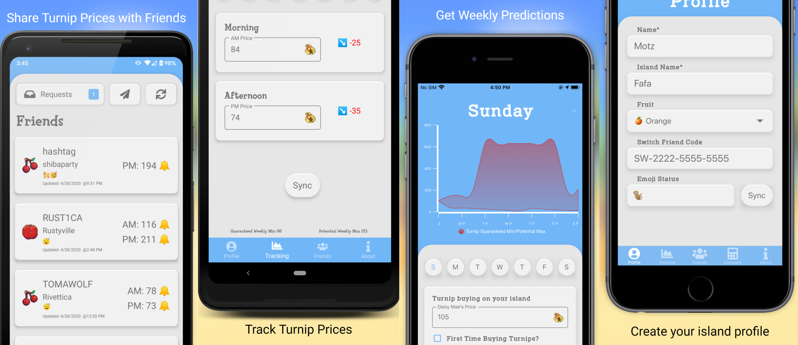

# Island Tracker for Animal Crossing
 Animal Crossing Turnip Tracking Mobile App
 Island Tracker is the ultimate Animal Crossing New Horizons app to help you get the most out of your turnips by getting daily predictions and sharing your prices with friends.

-> Get predictions and trends so you know when to sell
-> Share turnip prices with up to 10 friends
-> Easiest way to share switch friend codes!
-> Ensure you always get the most $ for your turnips
-> Helpful turnip calculators

Island Tracker is here so you never have to mass text message your friends again asking them for their turnip prices. Create your friend list, share turnip prices, get rewarded in Animal Crossing!

Built with [Xamarin.Forms](https://xamarin.com), Azure Functions, and Azure Table Storage!
 

## Available today

## Build Status

* Android - 
* iOS - 

## Built with

* [Xamarin.Forms](https://www.xamarin.com/forms)
* [Xamarin.Forms Material](https://docs.microsoft.com/xamarin/xamarin-forms/user-interface/visual/material-visual?WT.mc_id=appacislandtracker-github-jamont)
* [Xamarin.Essentials](https://www.github.com/xamarin/essentials)
* [App Center](https://appcenter.ms)
* [Monkey Cache](https://github.com/jamesmontemagno/monkey-cache)
* [Mvvm Helpers](https://github.com/jamesmontemagno/mvvm-helpers)
* [PancakeView](https://github.com/sthewissen/Xamarin.Forms.PancakeView)
* [Resizetizer.NT](https://github.com/Redth/ResizetizerNT)
* [Sharpnado - MaterialFrame & More](https://github.com/roubachof/Sharpnado.Presentation.Forms)
* [Syncfusion - ComboBox, MaskedEdit, NumericTextBox, Shimmer, Effects, TextInputLayout](https://www.syncfusion.com/xamarin)

## Custom fonts

* [Font Awesome](https://fontawesome.com)
* [Custon font work by Omaima Khan](https://www.fiverr.com/omaimakhan)

## Custom Artwork
* [Icon & Fruit by Ardon Pixels](https://linktr.ee/ardonpixels)

## Made possible by

The hard work of [Mike Bryant](https://github.com/mikebryant) for porting over [Ninji's](https://twitter.com/_Ninji/status/1244818665851289602?s=20) work into a JS library and creating [Turnip Prophet](https://turnipprophet.io/).

Predictions not possible without the hard work from [sparkie108](https://github.com/sparkie108) who ported tons of code to C#!
